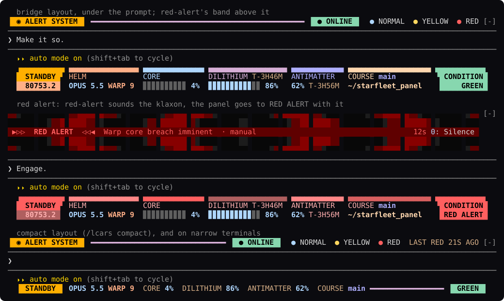

# starfleet-panel

**An LCARS status panel for Claude Code.** The readouts that usually sit
under the prompt (model, effort, context window, rate limits, directory,
git branch) are drawn as a 24th-century Starfleet console from *The Next
Generation*: an elbowed frame, a sidebar, segmented bars and the stardate.
It's built to sit beside [red-alert](https://github.com/dukechain2333/red-alert).
When red-alert sounds the klaxon, the panel goes to RED ALERT with it.



- **Everything at a glance, LCARS style.** Model and effort (as a warp
  factor), a context-window gauge, the 5-hour and 7-day limits with
  countdowns to their reset, the working directory, git branch and Python
  env, the local time and the stardate.
- **Made for red-alert.** It shows red-alert's condition (green, muted,
  offline). While an alert is up, it repaints the whole frame in the alert's
  color and blinks the sidebar for as long as red-alert's klaxon animates.
  The two mods never touch each other's screen space, keys, commands or
  state.
- **Fits any width.** It's a three-row frame on terminals 76 columns wide
  and up. As the terminal narrows, it drops the least important readouts
  first, and below 76 columns it becomes a one-row strip.
- **Local and free.** It makes no model calls and no network requests. The
  figures come from the same in-process data the status line uses.

## The readouts

| Panel label | Plain label | What it shows |
| --- | --- | --- |
| sidebar | | `STANDBY` while idle, `ENGAGED` while Claude works (plain: `IDLE` / `WORKING`); the alert's title during an alert |
| `HELM` | `MODEL` | the model (`OPUS 5.5`) and reasoning effort as a warp factor: low `IMPULSE`, medium `WARP 5`, high `WARP 7`, xhigh `WARP 9`, max `WARP 9.6` |
| `CORE` | `CTX` | context window used, with a 10-cell gauge |
| `DILITHIUM` | `5H` | the 5-hour limit: how much is **left**, a gauge, and `T-2H14M` to the reset |
| `ANTIMATTER` | `7D` | the 7-day limit: how much is left and `T-3D4H` to the reset |
| `ENERGY` | `COST` | the session's cost (off by default) |
| `SECTOR` | `DIR` | the working directory, `~` for home |
| `COURSE` | `GIT` | the git branch, or `@<sha>` when detached |
| `ENV` | `ENV` | the active conda env (not `base`) or virtualenv |
| | | `user@host` (can be turned off) |
| `STARDATE` | | the date in TNG's broadcast reckoning: 41000 when the show began in 1987, a thousand units a year |
| condition pill | | red-alert's state: `CONDITION GREEN`, `GREEN · MUTED`, `ALERTS OFFLINE`, or the alert itself |

Readings turn yellow at 60% used and red at 80%. These are the thresholds of
the classic `statusLine` script the panel replaces. The 5-hour and 7-day
limits appear once Claude Code has a reading for them: on a Pro or Max
subscription, after the first response.

## With red-alert

Install both and they share one console: red-alert's band above the prompt
and this panel below it, in the same LCARS palette.

| red-alert's state | The panel |
| --- | --- |
| online | `▐ CONDITION GREEN ▌` at the end of the bottom bar |
| muted | `▐ GREEN · MUTED ▌` |
| offline | `▐ ALERTS OFFLINE ▌` |
| an alert is up | the frame turns the alert's color, and the sidebar and pill read `RED ALERT` (or the level's title) |
| a red or yellow alert animating | the sidebar blinks with it, then holds steady until you silence or dismiss the alert (`0`, red-alert's key) |
| not installed | the bar ends in an elbow; everything else works the same |

The mods don't conflict because each one draws, binds and stores only what
it owns:

| | red-alert | starfleet-panel |
| --- | --- | --- |
| Draws | the band above the prompt, the `/alert` console, its tool's row | the hint line under the prompt, nothing else |
| Command | `/alert` | `/lcars` |
| Tools and system prompt | the `alert` tool and a short alert policy | none |
| Keys | `0` silences; band items via `ctrl+x tab` | none: no buttons, no hotkeys |
| State | its own | its own; reads red-alert's `link` and `active`, never writes them |

The panel learns of a new alert the moment red-alert records it. It does this
with an observe-only hook on red-alert's state, which passes every value
through exactly as red-alert wrote it. Set `followRedAlert` to `false` to
ignore red-alert altogether.

## Install

```bash
git clone https://github.com/dukechain2333/starfleet-panel.git
cd starfleet-panel
./install.sh
```

This copies the mod to `~/.claude/skills/starfleet-panel`. Start a new
Claude Code session and it loads as `starfleet-panel@skills-dir`. Use
`./install.sh --link` to symlink the checkout instead while you work on it,
and `./uninstall.sh` to remove it.

The repository is also a plugin marketplace:

```bash
claude plugin marketplace add dukechain2333/starfleet-panel
claude plugin install starfleet-panel@starfleet-panel
```

**Retire your `statusLine` command.** If `~/.claude/settings.json` has a
`statusLine` entry, its line keeps drawing above the panel and you see the
same figures twice. Remove the entry to let the panel take over. The panel
tells you once, the installer reminds you, and `/lcars` mentions it while
one is set.

Requirements: Claude Code with mod support (function-hook plugins; built and
tested on 2.1.288), and a terminal with true color and a monospace font that
has the block elements (`▄ ▀ ▌ ▗`). Any modern terminal font does.

## Using it

The panel needs nothing from you. It refreshes the context window and limits
every 2 seconds. It re-reads the directory, branch, env and settings after
every turn and every 30 seconds.

- **Layouts:** `bridge`, the three-row frame (the default); `compact`, one
  row in the style of red-alert's idle strip; `off`, only Claude Code's own
  hint line. Bridge falls back to compact on terminals narrower than 76
  columns and in the desktop app.
- **`/lcars`** prints a full status report. It lists every reading beside
  what its Starfleet name stands for, which makes it a legend too:

  ```
  LCARS STATUS REPORT · STARDATE 80753.1 · 22:32

  HELM        (model, effort)      OPUS 5.5 · xhigh effort (warp 9)
  CORE        (context window)     4% used · 43K of 1M tokens
  DILITHIUM   (5-hour limit)       95% left · resets in 4h18m
  ANTIMATTER  (7-day limit)        63% left · resets in 4h28m
  ENERGY      (session cost)       $0.35
  SECTOR      (working directory)  ~/starfleet_panel
  COURSE      (git branch)         main
  ENV         (python env)         none
  CONDITION   (red-alert)          condition green
  ```

- **`/lcars bridge | compact | off`** switches the layout for this session.
  `/lcars reset` goes back to the setting.

### Settings

Set these in `/config` (or `claude plugin configure starfleet-panel`):

| Setting | Default | |
| --- | --- | --- |
| `layout` | `bridge` | `bridge`, `compact` or `off` |
| `labels` | `starfleet` | `starfleet` (HELM, CORE, DILITHIUM…) or `plain` (MODEL, CTX, 5H…) |
| `showCost` | `false` | add the session's cost |
| `showUserHost` | `true` | add `user@host` to the bottom bar |
| `followRedAlert` | `true` | show red-alert's condition and repaint with its alerts |
| `refreshSeconds` | `2` | how often the context window and limits are re-read |

## How it works

The mod draws Claude Code's `PromptHint` site, the hint line under the
prompt. It returns its own rows together with the engine's line, so the mode
pill (`⏵⏵ auto mode on`) and hints such as `esc to interrupt` stay live
above the frame. Its figures come from `$.session.usage()` and
`$.session.model()`, which are free in-process calls. The effort is the one
each main-loop request was actually sent with, recorded by an observe-only
`turn.step` hook that leaves the response stream untouched. Before the first
request, the effort comes from your settings.

## Development

```bash
claude plugin validate plugin     # manifest and hooks, as the engine reads them
claude plugin test plugin         # the tests: layouts, red-alert states, /lcars
claude --plugin-dir plugin        # try it; saving a file reloads it
npx -p typescript tsc -p plugin   # type-check, once a session has loaded the mod
                                  # (it lays the types in plugin/.claude-plugin/types)
```

Layout: `plugin/hooks/register.tsx` (hooks, sensors, drawing),
`plugin/hooks/panel.ts` (the layouts and the report), `plugin/hooks/lcars.ts`
(palette and row fitting), `plugin/hooks/readouts.ts` (stardate, warp
factor, gauges, cell widths), `plugin/types/index.d.ts` (the state contract),
`plugin/tests/`.

`docs/preview.svg` comes from a real session. Capture it with
`tmux capture-pane -e -p -t <session> > capture.ans`, then convert it with
`python3 docs/ansi2svg.py capture.ans docs/preview.svg --rows <first>-<last>`.

## Credits

The panel borrows the look of LCARS, the computer interface designed by
Michael Okuda for *Star Trek: The Next Generation*. This is an unofficial fan
project. Star Trek and its marks belong to their respective owners.

## License

[MIT](LICENSE)
